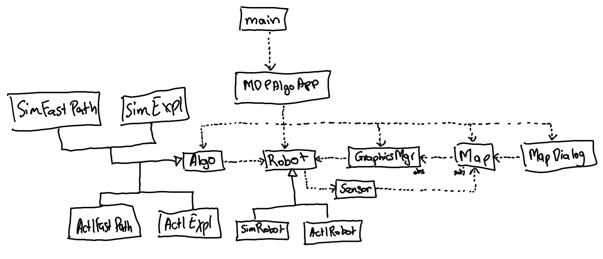

# mdp-algorithm
MDP Algorithm

## Class Diagram


## How to install dependencies
```
pip install -r requirements.txt
```

## How to run the application
The entry point of the app is main.py in the src folder
```
python main.py
```